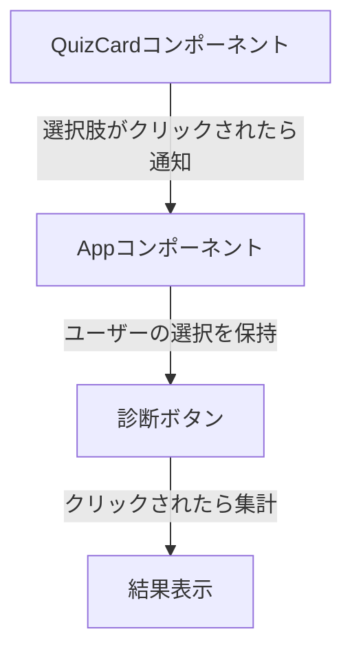

# 設計

## 問題文、選択肢 `quizItem`のデータ構造

```typescript
type QuizItem = {
    question: string,
    choices: Choice[],
};
type Choice = {
    // 選択肢の文
    sentence:string,
    // 評価項目の値
    evaluationScore:EvaluationCriteria,
};
type EvaluationCriteria = {
    // スコアは -1.0 ~ 1.0 で付ける
    // 自己愛・自己嫌悪（プラスが自己愛）
    selfEsteemLevel:null|number,
    // 外交的・内向的の軸（プラスが外交的）
    extroversionLevel:null|number,
    // 発信と受信（プラスが発信）
    energyEmissionLevel:null|number,
};
// フォームから集計されるデータ。answerはJSON形式で、デコードするとEvaluationCriteria型になる。
type Answers = { [index: string]: { answer: string } };

```

`const answersArray: EvaluationCriteria[]`が`calculateScore`の引数になる。

## 評価の計算方法

評価項目の値`evaluationScore`で非nullの値の平均値を評価値とする。
評価項目の値は絶対値が１以下なので、その平均値である評価値も絶対値が１以下になる。
ならなかったら切り捨てでいいかな。

評価値を求める`calculateScore`の処理の流れは以下のようになる。

1. evaluationScoreの各プロパティ名をプロパティ名に、値としてリストを持つオブジェクトを内部変数として定義
2. 内部変数のリストに`quizItems[i].answer.property`をnullでないならappendする
3. 内部変数のリストについて平均値を求める（以下のメソッドを定義する）
   1. 長さが0ならばnullを入れる
   2. そうでないならば、リストの要素の合計値をリストの長さで割った値を返す
4. 内部変数の各プロパティ名と平均値がセットになったオブジェクトを返す

なので引数は`quizItems`, 戻り値は`EvaluationCriteria`型のオブジェクト。

## フォームの設計



### 2023/11/26のメモ

Data.tsのクイズデータを状態管理する。
またボタンを押して選択した際の挙動はuseFormを使って実現する？

calculateScoreの挙動で、未回答のものがあれば
その番号のところまでスクロールさせる挙動にする

```typescript
import React from 'react';

function ScrollButton() {
  const handleClick = () => {
    const element = document.getElementById('target');
    if (element) {
      window.scrollTo({
        top: element.offsetTop, // スクロール先のy座標
        behavior: 'smooth' // スクロールの動きを滑らかにする
      });
    }
  };

  return (
    <button onClick={handleClick}>
      Scroll to position
    </button>
  );
}

export default ScrollButton;
```

### 2023年12月23日のメモ
これからやりたいこと⇒アプリのwithを参考に見た目を作る
1. [ ] ヘッダーをつける
2. [X] 心理テストの画面デザインを作る
  - [X] バリデーションをつけたほうがいいかな？要相談
  - [X] 全部回答したら診断ボタンまで自動でスクロールする
  - １問ずつ画面が切り替わるUIはどのように作るのだろうか？　withのような
3. [ ] チャット機能を作る
4. [ ] ユーザーの認証・認可機能を作る